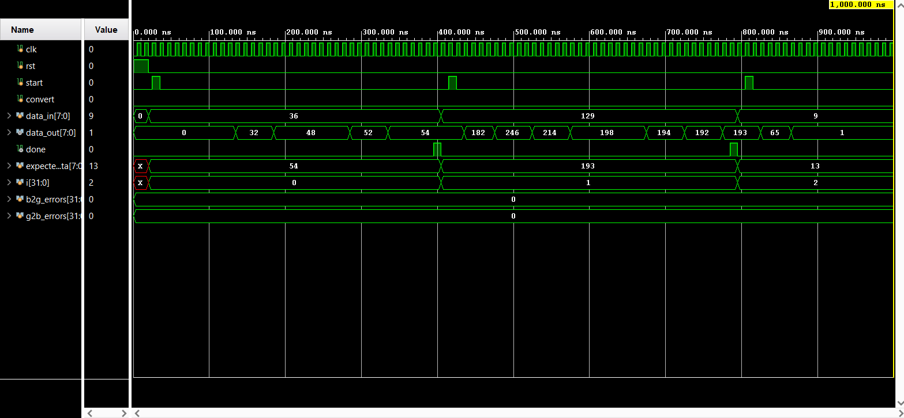

# Resource-Constrained Serial Code Converter (Binary ↔ Gray)

This repository contains the RTL implementation and verification of an area-optimized, bi-directional 8-bit Binary-to-Gray and Gray-to-Binary code converter. 

This project was designed to strictly adhere to severe hardware resource constraints, demonstrating proficiency in custom datapath routing, Moore FSM design, and automated self-checking verification.

## 🚀 Key Architectural Features
* **Extreme Area Optimization:** The entire algorithmic computation is restricted to a **single XOR gate**, trading latency for a significantly reduced physical footprint.
* **Bi-Directional Conversion:** A single control signal (`Convert`) dynamically branches the FSM to calculate either Binary-to-Gray ($G_i = B_{i+1} \oplus B_i$) or Gray-to-Binary ($B_i = B_{i+1} \oplus G_i$).
* **Custom Datapath:** * Utilizes two 8-bit PIPO (Parallel-In Parallel-Out) registers for source and destination storage.
  * Implements a 1-bit internal shared interconnect bus.
  * Uses Multiplexers, De-multiplexers, and Tri-state buffers to safely route serial data bit-by-bit and prevent bus contention.

## 🧠 Control Unit (Moore FSM)
The process flow is governed by a synchronous Moore Finite State Machine that schedules the serial operations over multiple clock cycles:
1. **MSB Transfer:** Directly copies the MSB from the source register to the destination register.
2. **Loop Execution:** Iteratively loads the correct operands ($B_i$ and $B_{i+1}$ or $G_i$) from the bus into two 1-bit holding registers (R3, R4).
3. **Computation & Writeback:** Triggers the single XOR gate and drives the result back onto the shared bus to be latched by the correct bit-index of the destination register.
4. **Completion:** Asserts a `done` signal once all 8 bits are successfully converted.

## 🛠️ Verification Methodology
The design is verified using an industry-standard **Self-Checking Testbench** executed in Xilinx Vivado. 

* **Golden Model Integration:** The testbench includes a behavioral "Golden Model" (written in a C++ style function within Verilog) that calculates the expected output combinationally.
* **Exhaustive Randomized Testing:** The RTL output is compared against the Golden Model across **2,000 randomized test vectors** (1,000 for Binary-to-Gray, 1,000 for Gray-to-Binary).
* **Result:** `0 Errors` across all clock-cycle accurate simulations.

## 📊 Simulation Results
The waveform below demonstrates the serial bit-by-bit calculation. Notice the `data_out` updating progressively (validating the single-XOR serial architecture) and the error counters remaining flat at `0` across the automated 2,000 vector test.

## 📂 File Structure
* `b2g_top.v` : Top-level wrapper instantiating the Datapath and FSM.
* `control_unit.v` : The Moore FSM governing the tri-state bus and register enables.
* `datapath.v` : The physical hardware, registers, multiplexing logic, and ALU.
* `tb_b2g_top.v` : The self-checking testbench with the Golden Model.

## 💻 How to Simulate (Vivado)
1. Add `b2g_top.v`, `control_unit.v`, and `datapath.v` as Design Sources.
2. Add `tb_b2g_top.v` as a Simulation Source.
3. Run Behavioral Simulation for `500 us`.
4. Check the Tcl Console for the automated pass/fail assertion logs.
